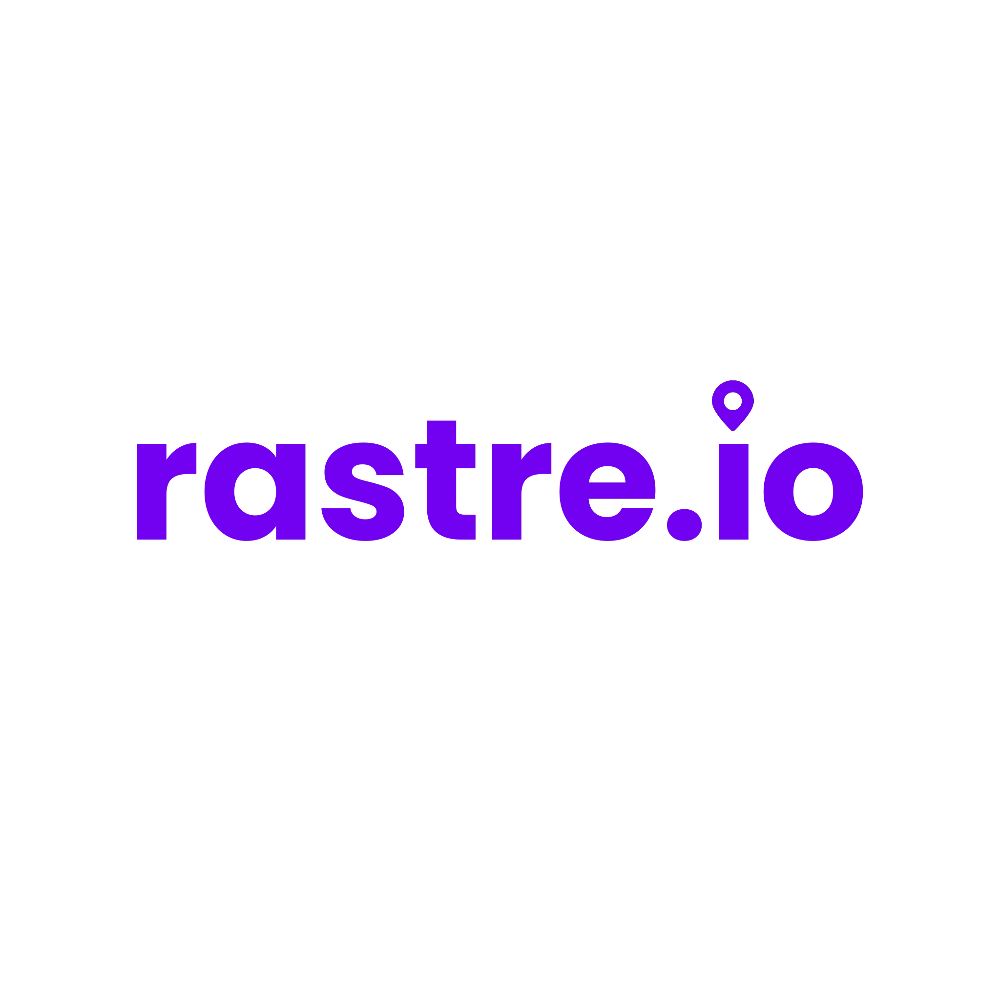

# rastre.io 📦

> **Sistema de Rastreamento Logístico de Frotas e Encomendas** — Locatrans



## 📋 Sobre o Projeto

O **rastre.io** é um sistema de rastreamento logístico desenvolvido para a **Locatrans**, substituindo o acompanhamento manual por WhatsApp por uma plataforma web organizada, acessível e funcional. O sistema está integrado ao **Firebase (Auth e Firestore)** para persistência de dados.

### O que o sistema faz:
- ✅ **Rastreamento público** — Clientes consultam encomendas sem login
- ✅ **Dashboard interno** — Funcionários monitoram entregas e frota
- ✅ **Scanner QR** — Motoristas atualizam status em campo
- ✅ **Mapa da frota** — Localização em tempo real dos caminhões (Firestore)
- ✅ **Gerenciamento de usuários** — Admin controla acessos e permissões (Firebase Auth + Firestore)

---

## 🚀 Como Rodar

### Pré-requisitos
- Node.js 18+ 
- npm 9+
- Projeto no Firebase configurado

### Configuração do Ambiente (.env)

Crie um arquivo `.env` na raiz do projeto com as credenciais do seu Firebase:

```env
VITE_FIREBASE_API_KEY=seu_api_key
VITE_FIREBASE_AUTH_DOMAIN=seu_auth_domain
VITE_FIREBASE_PROJECT_ID=seu_project_id
VITE_FIREBASE_STORAGE_BUCKET=seu_storage_bucket
VITE_FIREBASE_MESSAGING_SENDER_ID=seu_messaging_sender_id
VITE_FIREBASE_APP_ID=seu_app_id
VITE_FIREBASE_MEASUREMENT_ID=seu_measurement_id
```

### Instalação

```bash
# Clone o repositório
cd Rastreio

# Instale as dependências
npm install

# Inicialize os dados (Seeding)
# O app irá semear o banco automaticamente na primeira execução do Dashboard,
# ou você pode rodar o script manual:
npm run seed
```

### Desenvolvimento

```bash
npm run dev
```

---

## 🛠️ Arquitetura e Estrutura

### Stack Tecnológica
| Tecnologia | Uso |
|------------|-----|
| **React + Vite** | SPA com HMR rápido |
| **React Router v6** | Roteamento SPA |
| **Firebase Auth** | Autenticação de usuários |
| **Cloud Firestore** | Banco de dados NoSQL |
| **CSS vanilla** | Design system customizado |
| **Leaflet + OpenStreetMap** | Mapas e geolocalização |
| **Lucide React** | Biblioteca de ícones |
| **qrcode.react** | Geração de QR codes |
| **Context API** | Estado global de autenticação |

### Fluxo de Dados (Padrão Repository)
O projeto utiliza uma arquitetura em camadas para isolar o Firestore e manter os services focados na lógica de negócio:

```
Route → Page (Controller) → Service (Negócio) → Repository (Acesso a dados Firestore)
```

- **Repositories** (`src/shared/repositories/`): Contêm todo o acesso direto ao SDK do Firestore (queries, updates, batchs).
- **Services** (`src/modules/.../services/`): Contêm a lógica de processamento, regras de negócio e formatação de dados.

### Coleções do Firestore
* **`users`**: Perfis dos usuários com permissões/funções (admin, employee, driver).
* **`deliveries`**: Encomendas cadastradas.
* **`statusHistory`**: Registro histórico de cada alteração de status de cada entrega.
* **`locations`**: Placas de caminhões e coordenadas de latitude/longitude para exibição no mapa.

### Estrutura de Pastas
```
src/
├── app/                    # Configuração do app
│   ├── router/             # Rotas centralizadas
│   ├── layouts/            # Layouts (Public, Auth, Dashboard)
│   └── App.jsx             # Root component
│
├── modules/                # Módulos de domínio
│   ├── auth/               # Autenticação (Contexto e Login)
│   ├── tracking/           # Rastreamento público
│   ├── deliveries/         # Gerenciamento de entregas
│   ├── dashboard/          # Dashboard e estatísticas
│   ├── locations/          # Mapa da frota
│   ├── scanner/            # Scanner QR
│   └── users/              # Gerenciamento de usuários
│
├── shared/                 # Código compartilhado
│   ├── components/         # Componentes reutilizáveis
│   ├── hooks/              # Hooks customizados
│   ├── repositories/       # Camada de Repositórios Firestore
│   ├── utils/              # Firebase Config, utilitários e constantes
│   └── styles/             # Design system CSS
│
├── assets/                 # Imagens e recursos
└── main.jsx                # Entry point
```

---

## 🎨 Decisões de Design

- **Dark mode** na área interna — reduz fadiga visual para uso prolongado
- **Light mode** na área pública — mais amigável para clientes
- **Paleta roxa** (#7C3AED) — consistente com a identidade visual
- **Micro-animações** — staggered fade-in, hover effects, scan line no scanner
- **Responsivo** — funciona em desktop, tablet e mobile
- **Mapas dark** (CartoDB Dark) — coerente com o tema do dashboard

---

## 🔮 Evolução Futura

1. **Cloud Functions** — Para cálculos automatizados e disparos de emails.
2. **Cloud Messaging (FCM)** — Notificações push em tempo real para os motoristas e clientes.
3. **Offline Sync** — Habilitar o cache offline do Firestore para o scanner QR dos motoristas.
4. **GPS Real** — Integração com o GPS de um app nativo para atualizar a coleção `locations` dinamicamente.
5. **Relatórios Avançados** — Exportação das entregas em PDF/Excel.

---

## 📄 Licença

Projeto desenvolvido para a **Locatrans** como protótipo funcional integrado com Firebase.
